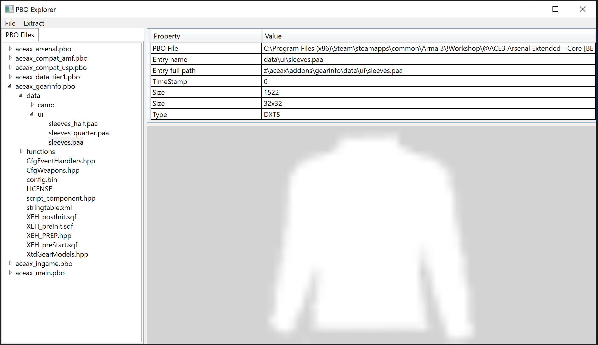
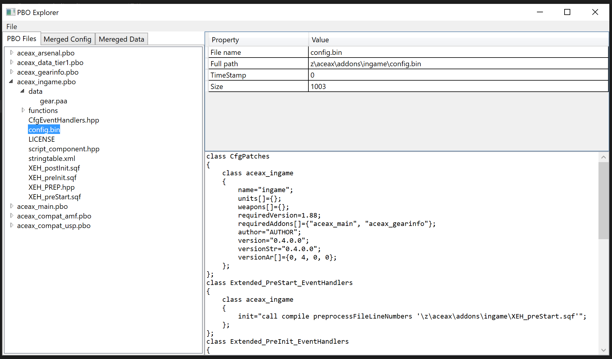

# PBO Explorer

**NB:** 
This repository is fork of Jetelain's [PBO Explorer](https://github.com/jetelain/PboExplorer) redesigned with the [Gemini](https://github.com/tgjones/gemini) framework.
The work done in this repository is solely for the purpose of learning `Gemini` and evaluating it for use in future projects.

The current version is functionally equivalent to the original, but has a different user interface (primarily a tabbed document interface).
This may change in the future when I try to evaluate Gemini's impact on app maintainability and extensibility, but support is not guaranteed or planned.

## Original README

Simple WPF tool to see content of a pbo file

It allows you to quickly check if packaging and macros have worked the expected way.

It also allows you to walkthrough Arma or mods PBO to check for configuration and files.
In that case, please check the licensing of files to ensure you are allowed to extract any data.

TIP: You can associate `PboExplorer.exe` to the `.pbo` file extension to easily open PBO files. Use "Open with..." context menu in Windows Explorer.

Powered by [Braini01's bis-file-formats](https://github.com/Braini01/bis-file-formats)

## Screenshots

### Before update:

### After:

