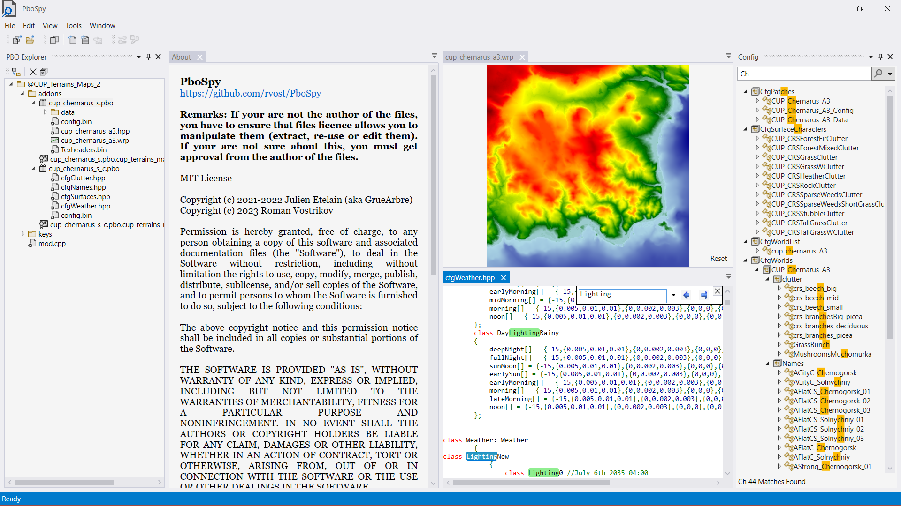

# PboSpy

**PboSpy is a graphical tool for exploring and extracting [PBO files](https://community.bistudio.com/wiki/PBO_File_Format).**

In case of bugs or feature requests, please send them via [Issues](https://github.com/rvost/PboSpy/issues). 
Any feedback is highly appreciated!

Please give this project a ⭐ if you find it useful!

## Features

* Explore the contents of ArmA and DayZ PBOs;
* Extract PBOs or individual files;
  **In that case, please check the licensing of files to ensure you are allowed to extract any data.**
* View and extract obfuscated PBOs;
* Preview files in PBO without extracting them;
* View class definitions (configs) in PBOs;
* Recover `.bikey` from `.bisign`.

## Installation

1. Download the `PboSpySetup.exe` installer from the [latest release](https://github.com/rvost/PboSpy/releases/latest) page.
  Other files required for updates and you don't need to download them manually.
2. Run the installer.
3. Your installation will be automatically updated as new releases become available.

Sometimes you may get a warning from Windows Defender or other anti-virus software.
You can safely ignore it.
This is because PboSpy is not a properly signed application. 

**OR** 

If you don't trust executables from the Internet, you can always build PboSpy from source.
In this case please note that PboSpy uses the git submodules so clone the repository with the `--recursive` option:

`git clone https://github.com/rvost/PboSpy.git --recursive`

If you already have cloned without the `--recursive`, you have to perform `git submodule init` followed by `git submodule update` in order to get all dependencies cloned.

## Related projects

You may also be interested in these *open source* projects which offer similar functionality and some unique features:

* [PboExplorer](https://github.com/jetelain/PboExplorer) is the predecessor of PboSpy, which can be used to modify files inside PBOs.
   * [PboExplorer (BisUtils)](https://github.com/FlipperPlz/PboExplorer) is a fork of PboExplorer with some new features like text search in files.
* [PakExplorer](https://github.com/FlipperPlz/PakExplorer) is a simple GUI application for opening/viewing/extracting Arma Reforger's PAC1 file format.
* [PboManager](https://github.com/winseros/pboman3) can be used to package PBOs and has Windows Explorer integration.
* [PboViewer](https://github.com/SteezCram/PboViewer) is a cross-platform PBO maker/unpacker.
* [OFP PBO Reader](https://github.com/ofpisnotdead-com/rust-pbo-wasm) can be used to view (OFP) PBO  content directly in your [web browser](https://ofpisnotdead-com.github.io/rust-pbo-wasm/).

## License

This project is licensed under the MIT License - see the [LICENSE](LICENSE) file for details

## Acknowledgments

This project is fork of  [Julien Etelain (GrueArbre)](https://github.com/jetelain) [PboExplorer](https://github.com/jetelain/PboExplorer) with most of the core code remained intact.

PboSpy is powered by [Braini01's bis-file-formats](https://github.com/Braini01/bis-file-formats), an indispensable library for working with BI formats in .NET

The [armake2](https://github.com/KoffeinFlummi/armake2) source code is used as a reference for understanding the BI signature (`.bisign`) and public key (`.bikey`) formats.

GUI built with [Tim Jones's Gemini framework](https://github.com/tgjones/gemini), released under the Apache 2.0 license.

Preview of  signatures, keys and other binary files implemented with [Derek Tremblay's WPF Hexeditor](https://github.com/abbaye/WpfHexEditorControl), released under the Apache 2.0 license.

Implementation of config search is based on [article](https://www.codeproject.com/Articles/1213031/Advanced-WPF-TreeViews-in-Csharp-VB-Net-Part-of-n) by Dirk Bahle and Alaa Ben Fatma.
